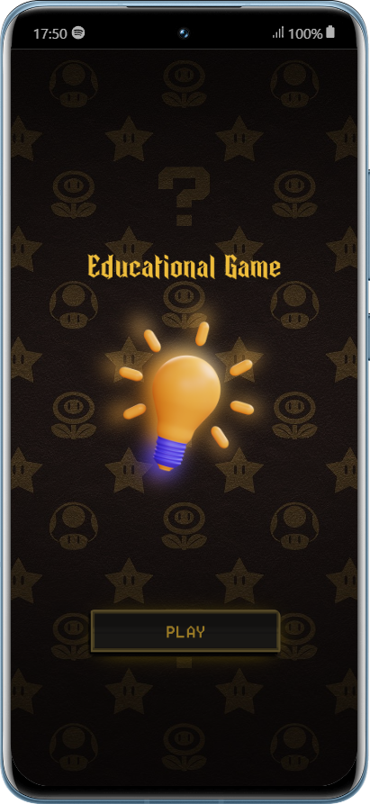
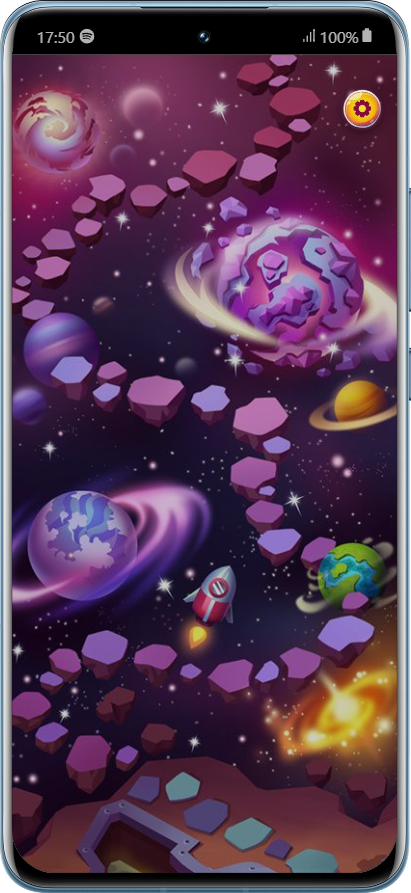

# Educational-Game
<br>

# Português

Visão Geral:
Este projeto marca a conclusão do meu Curso Técnico no Senac RJ, com foco no desenvolvimento de um jogo envolvente e educativo destinado ao ensino de inglês para crianças. Utilizando uma combinação de tecnologias modernas, o jogo proporciona uma experiência de aprendizado interativa e agradável para os pequenos aprendizes.  

<h2>Tecnologias Usadas</h2>
<p>Ionic</p>
<p>Angular</p>
<p>Phaser 3 (Framework javaScript)</p>

## Vamos Começar

Primeiro, vamos clonar o repositorio:

No seu terminal bash utilize esse comando para clonar esse repositório em sua máquina.

```
git clone https://github.com/Nilokrtz/Educational-Game.git
```

Após isso no terminal da pasta onde está o projeto utilize esse comando para baixar as dependências do Node.
<p>Observação:  Precisa ter o Node.js instalado em sua máquina para rodar o projeto.</p>

```
npm i
```

Após isso no terminal basta rodar o projeto com um dos comandos abaixo.

```
ionic serve
```

Abrirá no http://localhost:8100 do navegador, depois disso aperte F12 e ponha em uma resolução de mobile, pois o jogo foi feito para ser um aplicativo.

<br>

# English

Overview:
This project serves as the culmination of my Technical Course at Senac RJ, focusing on the development of an engaging and educational game aimed at teaching English to children. Leveraging a combination of modern technologies, the game provides an interactive and enjoyable learning experience for young learners.

<h2>Technologies Used</h2>
<p>Ionic</p>
<p>Angular</p>
<p>Phaser 3 (Framework javaScript)</p>

## Getting Started

To begin, clone the repository using the following command in your bash terminal:

```bash
git clone https://github.com/Nilokrtz/Educational-Game.git
```

Next, in the terminal, within the project folder, install the Node dependencies. Make sure to have Node.js installed on your machine before proceeding:

```
npm i
```
After installing the dependencies, run the project in the terminal with one of the following commands:
```
ionic serve
```

The application will be available at http://localhost:8100 in your browser. After that, press F12 and adjust to a mobile device resolution, as the game was designed to be used as a mobile application.
<br>
<br>
<div text-align:center>


</div>
